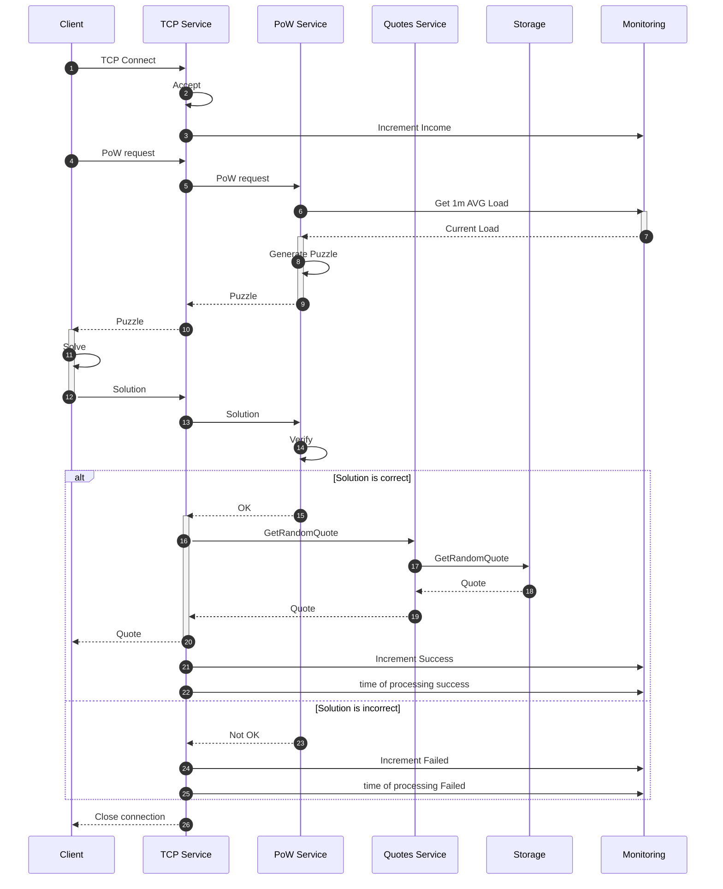

# ProofOfWork gateway to simple tcp service.

<!-- vscode-markdown-toc -->
* 1. [Problem statement](#Problemstatement)
* 2. [How to run](#Howtorun)
	* 2.1. [Requirements](#Requirements)
	* 2.2. [List of all available commands](#Listofallavailablecommands)
	* 2.3. [Building base image](#Buildingbaseimage)
	* 2.4. [Linter check](#Lintercheck)
	* 2.5. [Passing tests](#Passingtests)
	* 2.6. [Monitoring environment](#Monitoringenvironment)
	* 2.7. [Start server](#Startserver)
	* 2.8. [Start client](#Startclient)
	* 2.9. [Start load-test](#Startload-test)
	* 2.10. [Update quotes from another repo](#Updatequotesfromanotherrepo)
* 3. [Solution](#Solution)
	* 3.1. [Sequence diagram](#Sequencediagram)
	* 3.2. [Common way of configuration of all service components](#Commonwayofconfigurationofallservicecomponents)
	* 3.3. [Quotes](#Quotes)
	* 3.4. [Quotes Model](#QuotesModel)
	* 3.5. [TCP Server Component](#TCPServerComponent)
	* 3.6. [PoW Algritm](#PoWAlgritm)
	* 3.7. [Function F()](#FunctionF)
	* 3.8. [Challenge difficulty](#Challengedifficulty)
* 4. [Server environment variables](#Serverenvironmentvariables)
* 5. [Client command lines](#Clientcommandlines)

<!-- vscode-markdown-toc-config
	numbering=true
	autoSave=true
	/vscode-markdown-toc-config -->
<!-- /vscode-markdown-toc -->


##  1. <a name='Problemstatement'></a>Problem statement

Test task for Server Engineer

Design and implement “Word of Wisdom” tcp server.  
 • TCP server should be protected from DDOS attacks with the Prof of Work (https://en.wikipedia.org/wiki/Proof_of_work), the challenge-response protocol should be used.  
 • The choice of the POW algorithm should be explained.  
 • After Prof Of Work verification, server should send one of the quotes from “word of wisdom” book or any other collection of the quotes.  
 • Docker file should be provided both for the server and for the client that solves the POW challenge

##  2. <a name='Howtorun'></a>How to run

###  2.1. <a name='Requirements'></a>Requirements

There are some issues, which I will fix shortly.  https://github.com/svkior/powgwey/issues


Possibly can work everywhere on Linux/MacOS X, but tested on this config:

1. OS: Mac OS X 12.5.1
3. Docker Desktop 4.4.2+
4. GNU Make 3.81
5. curl 7.79.1
6. code is compatible with golang 1.18.3

*There is no needence for installing golang locally, need access to the Internet for a first fime*

May be some issues when running on m1 mac's
###  2.2. <a name='Listofallavailablecommands'></a>List of all available commands

To list all of the available commands just type:

```bash
make help
```

###  2.3. <a name='Buildingbaseimage'></a>Building base image

The base image is used by other images to build, lint, test and check software in containers.

```bash
make build-base
```

Builind server image:

```bash
make build-server
```

Building client image:

```bash
make build-client
```

###  2.4. <a name='Lintercheck'></a>Linter check

```bash
make lint
```

###  2.5. <a name='Passingtests'></a>Passing tests

```bash
make test
```

###  2.6. <a name='Monitoringenvironment'></a>Monitoring environment

TODO: Still not works https://github.com/svkior/powgwey/issues/31
```bash
make start-monitoring
```

###  2.7. <a name='Startserver'></a>Start server

```bash
make start-server
```

###  2.8. <a name='Startclient'></a>Start client

```bash
make start-client
```

###  2.9. <a name='Startload-test'></a>Start load-test

If  server is  started  we can  run load test.

```bash
make start-loadtest
```

###  2.10. <a name='Updatequotesfromanotherrepo'></a>Update quotes from another repo

```bash
make update-quotes
```

##  3. <a name='Solution'></a>Solution

###  3.1. <a name='Sequencediagram'></a>Sequence diagram

WiP: https://github.com/svkior/powgwey/issues/20



###  3.2. <a name='Commonwayofconfigurationofallservicecomponents'></a>Common way of configuration of all service components

I choosed viper.

###  3.3. <a name='Quotes'></a>Quotes

I've taked quotes from different repo on github.

Permlink is : https://raw.githubusercontent.com/msramalho/json-tv-quotes/master/quotes.json

Service component "quotes" is located in server_internal/services folder

- configuration of this component is located in server_internal/config/quotes
###  3.4. <a name='QuotesModel'></a>Quotes Model

Component model:
I've taked quotes from different repo on github.

Permlink is : https://raw.githubusercontent.com/msramalho/json-tv-quotes/master/quotes.json

Service component "quotes" is located in server_internal/services folder

- configuration of this component is located in server_internal/config/quotes

Component model:

- NewQuotesService
- quotesService:
  - Init() Initialize component
  - Shutdown() Shutdown component
  - GetQuote() Get Quote

It can be assumed that in a highly loaded project, the payload will take some time.
Let's limit the fictitious load of the variable QUOTES_PROCESSING_TIME
We will create a work queue from QUOTES_WORKERS

###  3.5. <a name='TCPServerComponent'></a>TCP Server Component

According to https://github.com/svkior/powgwey/issues/12 I decided to implement No8.

Because for gaming industry the most important feature is a lattency.
Second important is maximum throughput.

If we can provide lattency, we can spend more mony for servers.

###  3.6. <a name='PoWAlgritm'></a>PoW Algritm

Descisions: https://github.com/svkior/powgwey/issues/15

I've found article https://users.soe.ucsc.edu/~abadi/Papers/memory-longer-acm.pdf and 

Memory-bound PoW is better because memory access performance is less sensitive to hardware and should generally work on both low and high-end hardware. In addition, it is expected that the performance of such an algorithm will be less sensitive to an increase in processor speed.

General design matches a proposed one where Server generates a random _x0_ and applies _F()_ to it _k_ times resulting in _xk_.

Client knows all information about the parameters of algorithm except the _x0_ and is expected to try all different paths towards _x0_.

When _x0_ is found, Client compares a checksum of a sequence to the checksum of a valid sequence received from the Server. When checksum matches, solution is found. Is checksums don't match, client goes for another sequence until valid is found.

###  3.7. <a name='FunctionF'></a>Function F()
Implementation of _F()_ will greatly affect difficulty and efficiency of an algorithm.
It is desirable that there are _x_ and _x'_, where _F(x)=F(x')_. This requires client to traverse both paths to check sequences, increasing required work.

In addition, it's required that calling inverted F() is slower that accessing inversion table, encouraging client to use memory instead of CPU. 

There is possibillity  to  change  current implementation of F() if needed.  

###  3.8. <a name='Challengedifficulty'></a>Challenge difficulty
Difficulty of this PoW can be configured with two parameters _k_ and _n_.

_k_ represents a number of times _F()_ is applied. Increasing this parameter will result in longer sequences and will affect both Client and Server

_n_ represents a range of possible values, which will be in a range [0, 2^n). Increasing it will mostly affect Client and not a Server, since Client will have to generate a larger inversion table and process more sequences, while Server will just generate a larger numbers. 

TODO:  https://github.com/svkior/powgwey/issues/36

##  4. <a name='Serverenvironmentvariables'></a>Server environment variables

```bash
###############################################
#  -=(* TCP SERVER CONFIG  *)=-
###############################################

SRV_PORT=8000
SRV_HOST=0.0.0.0
SRV_NET_READ_TIMEOUT=1s
SRV_NET_WRITE_TIMEOUT=1s

###############################################
#  -=(* QUOTES STORAGE COMPONENT CONFIG  *)=-
###############################################

# Fiction processing time of getting quotes
SRV_QUOTES_PROCESSING_TIME=0.3s

# Filepath of quotes database
SRV_QUOTES_FILEPATH=/opt/user/data/movies.json

###############################################
#  -=(* QUOTES SERVICE COMPONENT CONFIG  *)=-
###############################################

# Number of workers in Quotes workers queue
SRV_QUOTES_WORKERS=100
```
##  5. <a name='Clientcommandlines'></a>Client command lines

We have single parameter for describing connection string.

```bash
 client -server=127.0.0.1:8000
```